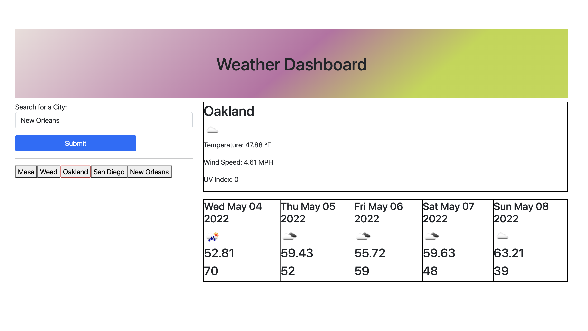

# VI-Weather-App
Weather Application using the weather API

Users will be able to enter a city
API call to OpenWeather is made
Will retrieve current weather and 5 day forecast
City will also be saved to local storage and will be stored upon refresh

